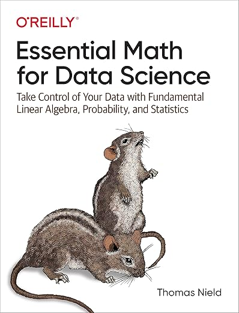
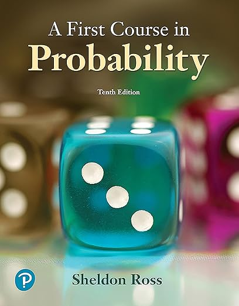
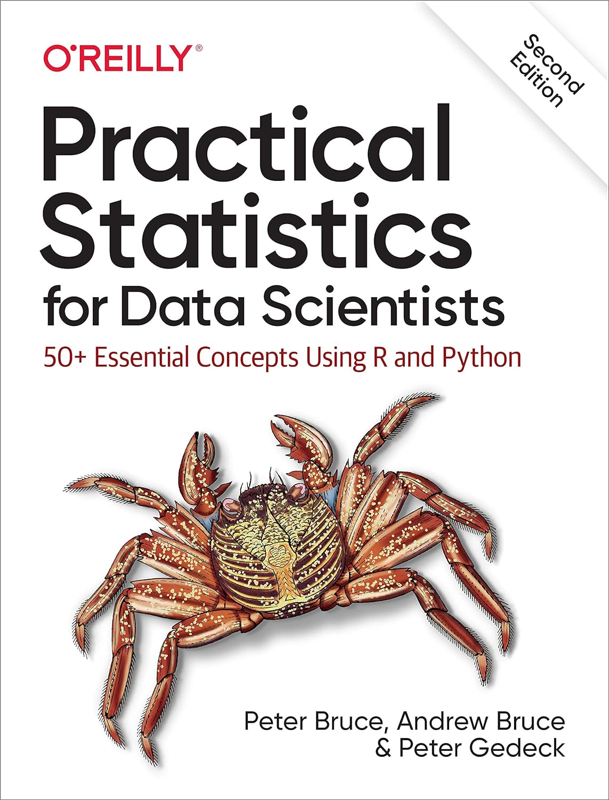

### Fundamental Maths for Data Scientists

Maths is essential to the tasks of an ML engineer or data scientist. This repository explores the essential topics of linear algebra, probability and statistics to enable one have a fundamental understanding of their applications.
Examples are drawn from works by <a href="https://www.amazon.com/Essential-Math-Science-Thomas-Nield-ebook/dp/B0B2HMGWQQ/ref=sr_1_1?crid=9KAUGBDQ0RC0&dib=eyJ2IjoiMSJ9.ijHh0EdbreEyKn_dFFgcd5KyFtVAQ2XmazDEXG_1qnvOI2pmG_6ospSig9O9d8tCgfqXeInTISYM1VfTSIg2GOtknRFpTNKh8mHyYwK570oN2z70dM9ai3rTEFzh7msBjfTW9T-TB6Z2Sjro5AFOUsUiSySy89CVaJuzysT-hqmLdHJNkWx3pJ7MbFHn-9ltmPtdXb88RrESbzsBlSAieHwl4aqfVQMPsCVpiRgqnRg.dASohX_OAE0SjLU8pILQLHYk5kTlikkmb8eKR76Xgr8&dib_tag=se&keywords=essential+math+for+data+science&qid=1725828248&s=digital-text&sprefix=essential+math+%2Cdigital-text%2C372&sr=1-1">Thomas Niel</a>
, <a href="https://www.amazon.com/First-Course-Probability-2-downloads-Sheldon-ebook/dp/B08T5Y2FBV/ref=sr_1_1?crid=37BCR1HJ7SH01&dib=eyJ2IjoiMSJ9.1VSFbhqvRmyRrdUxZYu3dAlmijzApYBMLZ7Av4q_MTner6pxbflpRVYVvTPnxZOWrO3vT67-RouAT0RHUCGAYOHACRL8doU3AFiF65U3F6hyhFs98xFevAUUMt9_dQzz3_XhMxbzws43YAahWCR-zSsAs0ZYLkfmE8wknEPbr3tnE_ZeZEHrDEilT9AvwhcqCFRAZNciNML2Vz4izfx1ctaBWz0MDPZ_29GrlX7ZpxY.-yku55Lv9XQiA68qIR8CVTbihk287b5QsuYLLDURD4M&dib_tag=se&keywords=first+course+in+probability&qid=1725828294&s=digital-text&sprefix=firsrt+course+%2Cdigital-text%2C329&sr=1-1">Sheldon Ross</a>
and <a href="https://www.amazon.com/Practical-Statistics-Data-Scientists-Essential-ebook/dp/B08712TT3F/ref=sr_1_1?crid=VNOHRX5MODES&dib=eyJ2IjoiMSJ9.0vawC-UkNGYN5PZKH33LNQUquThVC05C8-wthc9ipKoyCY42St-NhlDAVg08PIR3lgBFSJKIisN83uj9KZ2-G4edewhdA6iiMP97bnKw1F43iv28YVgnamP_QbuPgc0bQT-XQes_2eluC7_pv-x4dPMUSw5Ee5S_ufxPEIuWT1--caxH8JrzUHVPDQvGuh0yhkvIy01jz8ZD6oG6r3Yz_qd2v6xDLrnDn2X4ON0pa8k.fqFjer-O2LjWnReE8ggFlChUoo_paf89plfYdKtQEko&dib_tag=se&keywords=practical+statistics+for+data+scientists&qid=1725828337&s=digital-text&sprefix=practical+sta%2Cdigital-text%2C313&sr=1-1">Peter Bruce, Andrew Bruce and Peter Gedeck</a>

